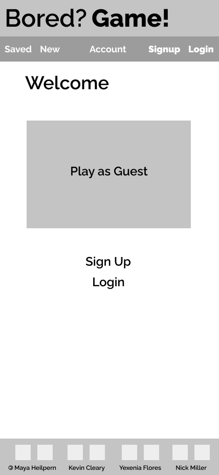
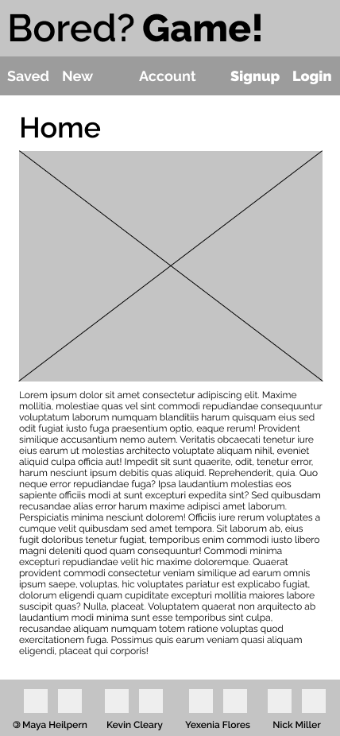
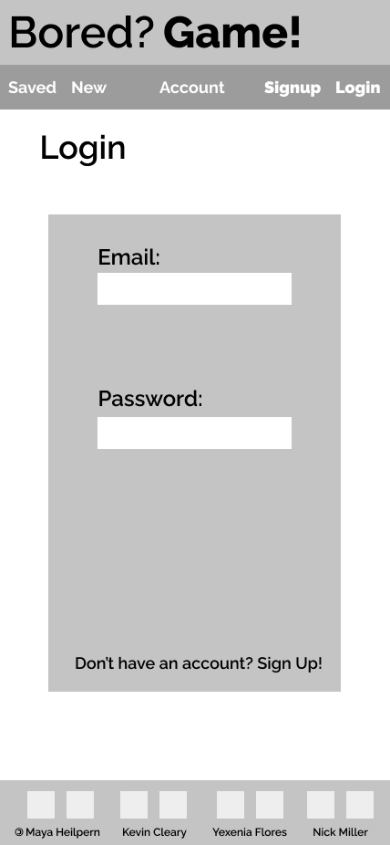
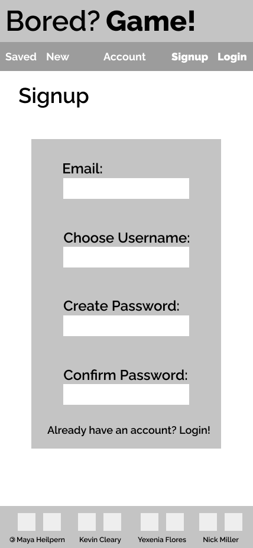
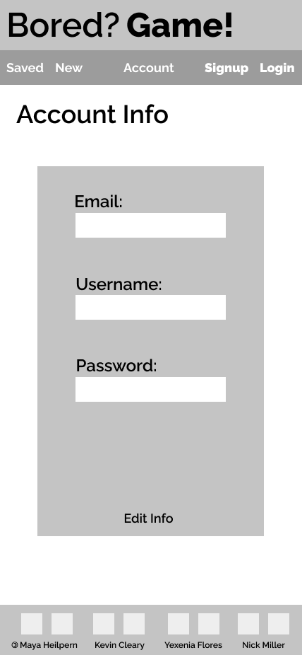
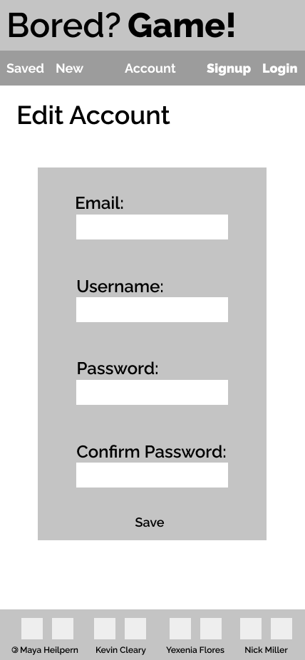
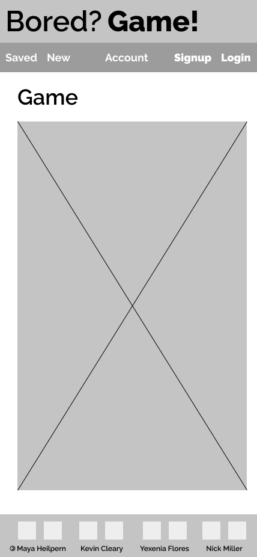
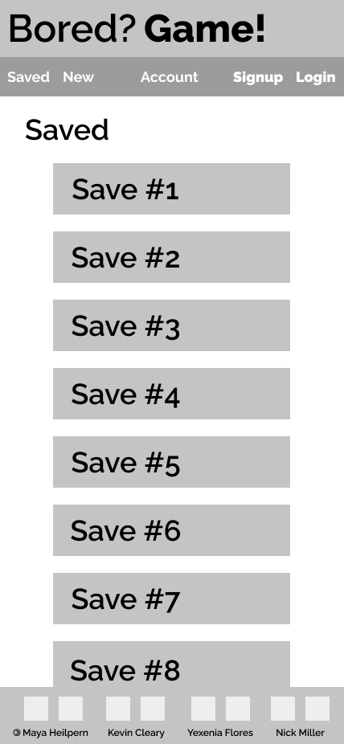
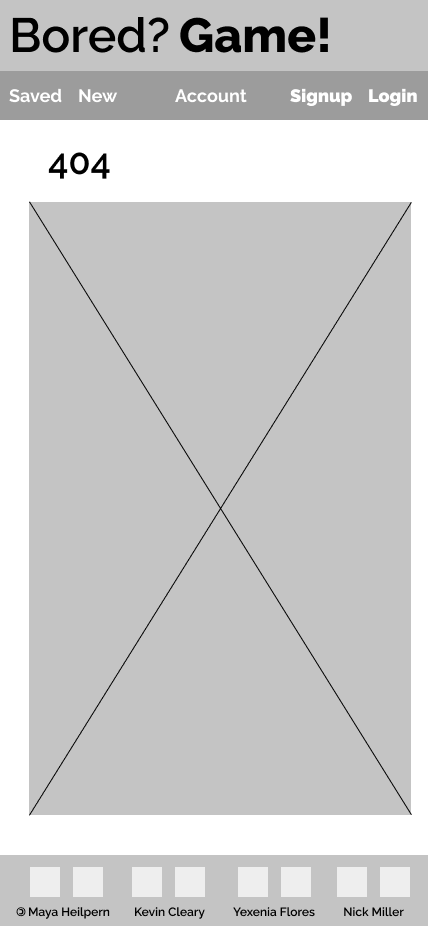

# BoredGame

## Project Overview

BoredGame is an online platform to play board games with friends. A user may sign in to slect a board game to be hosted online and played locally. Our vision is to start with a single game, and build out the catalog over time. 

## Team Expectations:
https://docs.google.com/document/d/1jPYh7i8NpYU8OhFO3R_PLyrBID4du4Nm7BLD5SFoG8Y/edit
## Wireframes
#### Landing Screen

#### Home Screen

#### Log In Screen

#### Sign Up Screen

#### Account Info Screen

#### Edit Account Info Screen

#### Game View Screen

#### Saved Screen

#### 404 Error Screen

###### [Wireframes created with Figma](https://www.figma.com/)

## Component Hierarchy

### MVP/PostMVP
We have setup our MVP and PMVP in our [Kanban](https://kanbanflow.com/board/WM5JWRc). 
(Please provide us with email in order for you to have access.)

## Timeframes

| Component | Priority | Estimated Time | Time Invested | Actual Time |
| --- | :---: |  :---: | :---: | :---: |
| Building Backend Routes| H | 3hrs| hrs | hrs |
| Building Backend Controllers| H | 3hrs| hrs | hrs |
| Backend Auth | H | 3hrs| hrs | hrs |
| Deploying Backend| H | 3hrs| hrs | hrs |
| Pseudo Coding | M | 3hrs| hrs | hrs |
| Building Frontend Components | H | 3hrs| hrs | hrs |
| Styling Components | M | 3hrs| hrs | hrs |
| Building Gameplay | H | 3hrs| hrs | hrs |
| Styling Game Display | M | 3hrs| hrs | hrs |
| Cleaning Code | M | 3hrs| hrs | hrs |
| Debugging | H | 3hrs| hrs | hrs |
| Deploying Frontend| H | 3hrs| hrs | hrs |
| Total | H | 36hrs| hrs | hrs |
